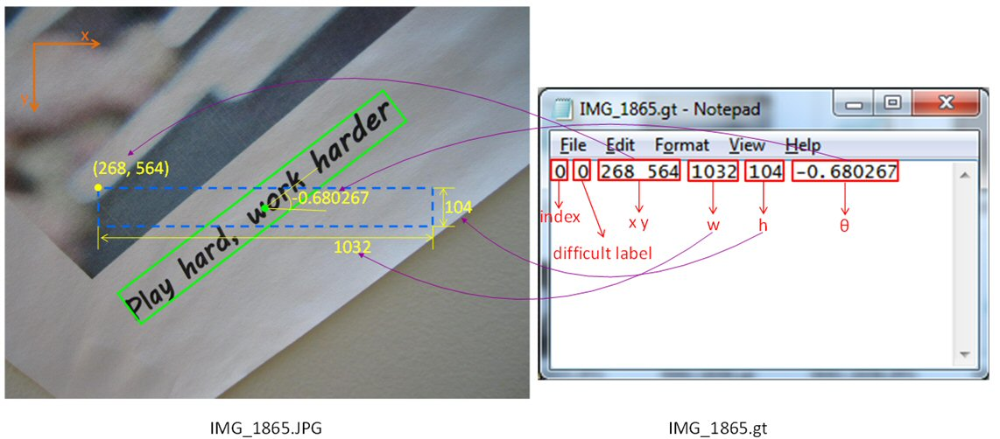

[TOC]


### CTW1500

#### 训练标注`ctw1500_train_labels/0001.xml`

```xml
<Annotataions>
  <image file="0001.jpg">
    <box height="25" left="56" top="506" width="203">
      <label>MEXICO, D. F.</label>
      <segs>56,506,89,506,123,506,157,506,191,506,225,506,259,506,259,531,225,531,191,531,157,531,123,531,89,531,56,531</segs>
      <pts x="68" y="519"/>
      <pts x="92" y="519"/>
      <pts x="113" y="519"/>
      <pts x="129" y="519"/>
      <pts x="147" y="519"/>
      <pts x="166" y="519"/>
      <pts x="182" y="526"/>
      <pts x="189" y="517"/>
      <pts x="204" y="518"/>
      <pts x="219" y="524"/>
      <pts x="228" y="517"/>
      <pts x="237" y="517"/>
      <pts x="251" y="524"/>
    </box>
      ... ...
  </image>
</Annotataions>
```


#### 测试标注`gt_ctw1500/0001001.txt`

```txt
71,169,106,156,141,148,177,148,213,153,249,154,285,163,302,89,258,75,212,82,167,86,121,89,80,61,37,52,####Pann's
195,227,208,226,221,225,235,224,248,223,261,222,275,222,275,204,261,204,247,205,233,205,219,206,205,206,192,207,####since 1958
96,280,108,279,120,278,132,278,144,277,156,276,168,276,165,257,152,258,140,260,128,261,115,263,103,264,91,266,####real food
```

每行共32个数字，前四个数字为该弯曲文本在整张图上的矩形框坐标值，

剩下的28个值为14个点，为相对于矩形框左上角得误差补偿即为与左上角坐标所形成的差值，形成封闭的弯曲文本框


### TotalText

`poly_gt_img11.txt`

```txt
x: [[214 280 362 349 284 231]], y: [[325 290 320 347 316 346]], ornt: [u'c'], transcriptions: [u'ASRAMA']
x: [[230 292 358 384 293 211]], y: [[402 430 395 419 463 425]], ornt: [u'c'], transcriptions: [u'PELAJAR']
x: [[ 53 120 121  56]], y: [[446 443 456 458]], ornt: [u'h'], transcriptions: [u'PERUNDING']
x: [[123 165 166 125]], y: [[443 440 453 455]], ornt: [u'h'], transcriptions: [u'PENILAI']
x: [[168 179 179 167]], y: [[439 439 452 453]], ornt: [u'#'], transcriptions: [u'#']
x: [[178 206 209 180]], y: [[441 438 451 454]], ornt: [u'h'], transcriptions: [u'EJEN']
x: [[ 53 148 149  51]], y: [[463 458 480 483]], ornt: [u'm'], transcriptions: [u'HENRY']
x: [[157 225 228 155]], y: [[457 452 476 479]], ornt: [u'm'], transcriptions: [u'BUTC']
x: [[ 48 141 142  53]], y: [[490 486 499 498]], ornt: [u'm'], transcriptions: [u'MALAYSIA']
x: [[151 185 185 154]], y: [[486 484 495 496]], ornt: [u'h'], transcriptions: [u'SEL']
x: [[196 236 237 199]], y: [[483 481 493 495]], ornt: [u'h'], transcriptions: [u'SDN']
x: [[244 283 286 246]], y: [[480 479 491 494]], ornt: [u'm'], transcriptions: [u'BHD']
```

TXT格式标注：分别存放所有x的坐标、所有y的坐标，**文本的方向**以及所包含**字符的内容**。 


转icdar格式 <https://blog.csdn.net/weixin_38708130/article/details/97010361>


### ABCNet训练标注

```json
{
  "licenses" : [],
  "annotations" : [
    {
      "rec" : [
        45,
        37,
        56,
        41,
        35,
        47,
        12,
        0,
        36,
        14,
        0,
        38,
        14,
        96,
        96,
        96,
        96,
        96,
        96,
        96,
        96,
        96,
        96,
        96,
        96,
        96,
        96,
        96,
        96,
        96,
        96,
        96,
        96,
        96,
        96,
        96,
        96,
        96,
        96,
        96,
        96,
        96,
        96,
        96,
        96,
        96,
        96,
        96,
        96,
        96,
        96,
        96,
        96,
        96,
        96,
        96,
        96,
        96,
        96,
        96,
        96,
        96,
        96,
        96,
        96,
        96,
        96,
        96,
        96,
        96,
        96,
        96,
        96,
        96,
        96,
        96,
        96,
        96,
        96,
        96,
        96,
        96,
        96,
        96,
        96,
        96,
        96,
        96,
        96,
        96,
        96,
        96,
        96,
        96,
        96,
        96,
        96,
        96,
        96,
        96
      ],
      "area" : 5304,
      "iscrowd" : 0,
      "category_id" : 1,
      "bbox" : [
        56,
        506,
        204,
        26
      ],
      "id" : 1,
      "image_id" : 1,
      "bezier_pts" : [
        56,
        506,
        123.67,
        506,
        191.33000000000001,
        506,
        259,
        506,
        259,
        531,
        191.33000000000001,
        531,
        123.67,
        531,
        56,
        531
      ]
    },
    ... ...
  ],
  "info" : {},
  "categories" : [
    {
      "id" : 1,
      "keypoints" : [
        "mean",
        "xmin",
        "x2",
        "x3",
        "xmax",
        "ymin",
        "y2",
        "y3",
        "ymax",
        "cross"
      ],
      "name" : "text",
      "supercategory" : "beverage"
    }
  ],
  "images" : [
    {
      "date_captured" : "",
      "height" : 549,
      "id" : 1,
      "flickr_url" : "",
      "width" : 369,
      "file_name" : "0001.jpg",
      "coco_url" : "",
      "license" : 0
    }
  ]
}
```

annotations：是每个标准框信息，其中rec是gt 文本的每个字符的索引号

images: 是所有图像信息，id是图像的编号


### MSRA500


