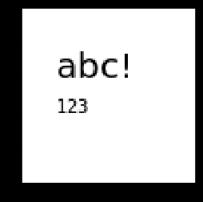
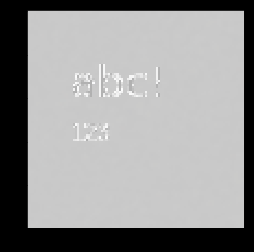

[TOC]

## 文字生成图像

a) 安装依赖包

```shell
pip install cairocffi
```


b) 导入包

```python
import cairocffi as cairo
import numpy as np
import matplotlib.pyplot as plt
```


c) 生成图像

```python
surface = cairo.ImageSurface(cairo.FORMAT_ARGB32, 100, 100)
context = cairo.Context(surface)
with context:
    context.set_source_rgb(1, 1, 1)  # White
    context.paint()
    fonts = ['Century Schoolbook', 'Courier', 'STIX', 'URW Chancery L', 'FreeMono']
    context.select_font_face(np.random.choice(fonts), cairo.FONT_SLANT_NORMAL,
                                     np.random.choice([cairo.FONT_WEIGHT_BOLD, cairo.FONT_WEIGHT_NORMAL]))

context.move_to(20, 40)  # 左下坐标
context.set_font_size(20)
context.show_text('ABC!')
context.move_to(20, 60)
context.show_text('123')
```


d)保存图像

```
surface.write_to_png('example.png')
```


e) 展示图像

```python
buf = surface.get_data()
a = np.frombuffer(buf, np.uint8)
a.shape=(100,100,4)
plt.imshow(a)
```



### 合成图像


```python
from PIL import Image
surface=cairo.ImageSurface.create_from_png('/opt/dataset/00020_annotated/num_img_all/image-000021_box0.png')
context = cairo.Context(surface)
fonts = ['Century Schoolbook', 'Courier', 'STIX', 'URW Chancery L', 'FreeMono']
context.select_font_face(np.random.choice(fonts), cairo.FONT_SLANT_NORMAL,
                                     cairo.FONT_WEIGHT_NORMAL)
context.move_to(5, 20)
context.set_font_size(25)
context.show_text('0')
```


```python
buf = surface.get_data()
a = np.frombuffer(buf, np.uint8)
a.shape=(surface.get_height(),surface.get_width(),4)
plt.imshow(a)
```


### 高斯模糊

```python
def speckle(img):
    blur = ndimage.gaussian_filter(np.random.randn(*img.shape)*0.2, 1)
    print(np.max(blur),np.min(blur))
    img_speck = (img*0.95 + blur*0.05)
    img_speck[img_speck > 255] = 255
    img_speck[img_speck <= 0] = 0
    return img_speck
```

```python
a = np.frombuffer(buf, np.uint8)
a.shape=(100,100,4)
a = speckle(a)
plt.imshow(a)
```


效果如下

